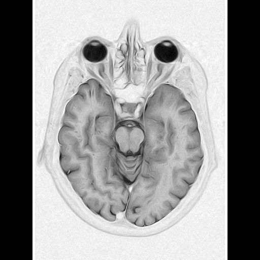
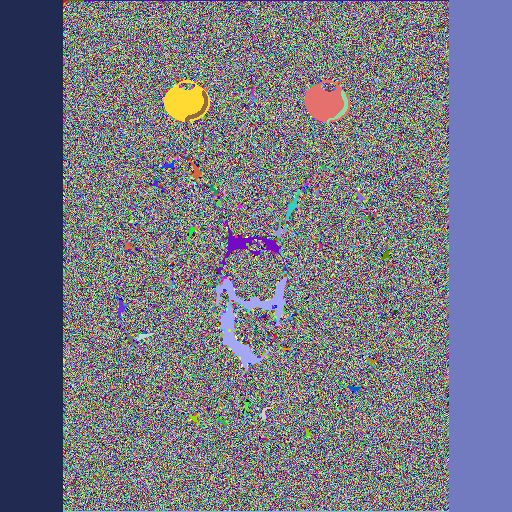

# 🏥 MedicalImageAnalysis.Web

A modular ASP.NET Core web application for uploading, visualizing, and analyzing medical images (DICOM, NIfTI, PNG, JPG). Designed for extensibility and cross-language reproducibility, this project is designated for showcasing basic medical image processing pipelines. 
Completed roadmap stages with example pictures are presented below.

## Features

- 📤 **Image Upload & Display**  
  Upload DICOM, PNG, JPG, and (planned) NIfTI files via a simple web UI.  
  DICOM metadata (patient, modality) is extracted and displayed.  
  Uploaded images are rendered and previewed in-browser.

- 🧩 **Modular Architecture**  
  - **Pages/**: Razor Pages UI  
  - **Services/**: Core logic (preprocessing, clustering, segmentation)  
  - **Models/**: Data models (e.g., image data, pipeline configs)  
  - **Data/**: File I/O and dataset loading  
  - **Utils/**: Shared helpers (image conversion, metrics, timing)

- 🚀 **Core Functionalities (Implemented)**  
  - **Data Loading**: DICOM, PNG, JPG (NIfTI skipped for now)
  - **Preprocessing**: PCA using Math.NET Numerics ✅
  - **Clustering**: K-means with configurable clusters ✅
  - **Segmentation Algorithms**: 
    - Otsu Thresholding ✅
    - Region Growing with adjustable tolerance ✅
    - Watershed (distance transform-based) ✅
  - **Visualization**: Flexible responsive grid with side-by-side comparison ✅

- ⚙️ **Pipeline Execution & State Management**  
  - Upload → Preprocessing (PCA) → Clustering (K-means) → Segmentation (Otsu, Region Growing, Watershed)
  - Persistent image state across postbacks via model binding
  - DICOM metadata extraction and display
  - Support for multi-frame DICOM files (frame count detection)

- 🌐 **Cross-Language Consistency**  
  - Deterministic seeds for reproducibility  
  - Well-defined input/output contracts  
  - Designed for future porting to Python or other languages

## 🛠️ Tech Stack

- **ASP.NET Core Razor Pages** (.NET 8)
- **fo-dicom** (DICOM support)
- **SixLabors.ImageSharp** (image processing)
- **MathNet.Numerics** (math, PCA, clustering)
- **Bootstrap, jQuery** (UI)

## ▶️ Getting Started

1. **Clone the repository**
   ```
   git clone https://github.com/Jonnius00/MedicalImageAnalysis.Web
   ```
2. **Install dependencies**  
   ```
   dotnet restore
   ```
3. **Build and run**  
   ```
   dotnet run
   ```
4. **Open in browser**  
   Navigate to `https://localhost:<port>` (port indicated in console)

## 📁 Project Structure

```
MedicalImageAnalysis.Web/
├── Pages/                 # Razor Pages UI (Upload.cshtml with image grid)
├── Services/              # Core algorithm logic (implemented)
│   ├── OtsuService.cs
│   ├── KMeansService.cs
│   ├── PCAPreprocessingService.cs
│   ├── RegionGrowingService.cs
│   └── WatershedService.cs
├── wwwroot/               # Static assets (CSS, JS, uploaded images)
│   ├── css/site.css       # Responsive grid layout
│   ├── images/            # Uploaded and processed images
│   └── js/site.js
├── Program.cs             # Dependency injection setup
├── MedicalImageAnalysis.Web.csproj
└── Properties/launchSettings.json
```

## 📅 Roadmap & Implementation Status

### ✅ Completed Features

- **Data Loading**: DICOM/PNG/JPG upload & preview with metadata extraction
  

- **Segmentation algorithms:** Binary segmentation by Otsu with automatic threshold computation
  

- **K-means Clustering**: Configurable cluster count (2-10) with color visualization
  

- **PCA Preprocessing**: shows reconstructed from top 2 components image. with explained variance ratios
  

- **Region Growing**: Seed-based segmentation with adjustable tolerance
  

- **Watershed Segmentation**: Distance transform-based segmentation with marker detection

  
- **Responsive Grid Layout**: Flexible CSS Grid that adapts to screen size
  - Side-by-side image comparison with proper aspect ratio preservation
  - Dynamic grid that scales from 1 column (mobile) to 3+ columns (desktop)
  - DICOM metadata persistence across algorithm applications

### 🛠️ In Progress / Future Improvements

- [ ] Multi-frame DICOM processing (currently detects frame count only)
- [ ] Performance metrics and execution timing
- [ ] Interactive overlays (Canvas/SVG for pixel-level inspection)
- [ ] Pipeline configuration UI and JSON serialization
- [ ] NIfTI file format support (skipped for now)

## 🎯 Key Implementation Details

### Algorithm Determinism
- All clustering and segmentation use fixed random seeds (e.g., `Random(42)`) for reproducibility
- Enables cross-language porting with guaranteed identical results

### Image Pipeline
1. **Upload**: DICOM/PNG/JPG → normalized to grayscale (L8) byte array
2. **Processing**: All algorithms operate on byte[] for cross-platform compatibility
3. **Visualization**: Results converted to RGBA32 images with distinct colors
4. **Storage**: PNG format (lossless, suitable for medical imaging)

### Responsive Design
- CSS Grid uses `repeat(auto-fit, minmax(300px, 1fr))` for flexible columns
- Breakpoints: Desktop (3+ cols), Tablet (2-3 cols), Mobile (1 col)
- Images maintain aspect ratio with `object-fit: contain`

## 📜 License

This project uses open-source libraries under MIT and similar licenses:
- fo-dicom 5.1.5 (DICOM support)
- SixLabors.ImageSharp 3.1.11 (image processing)
- MathNet.Numerics 5.0.0 (algorithms)
- Bootstrap, jQuery (UI components)

See `/wwwroot/lib/*/LICENSE` for details. 
