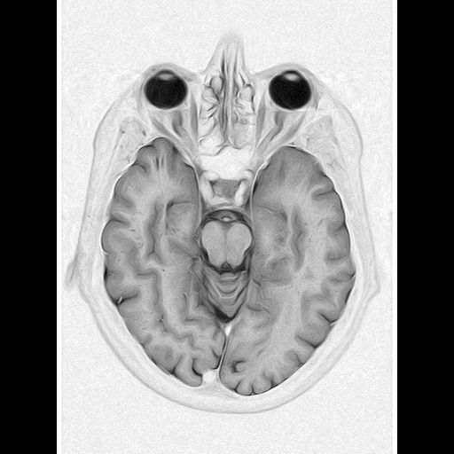
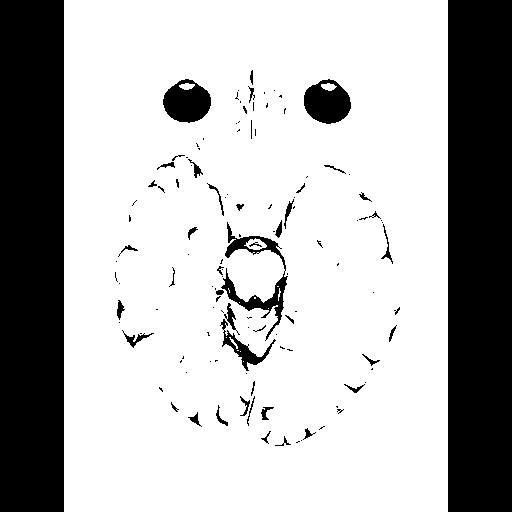
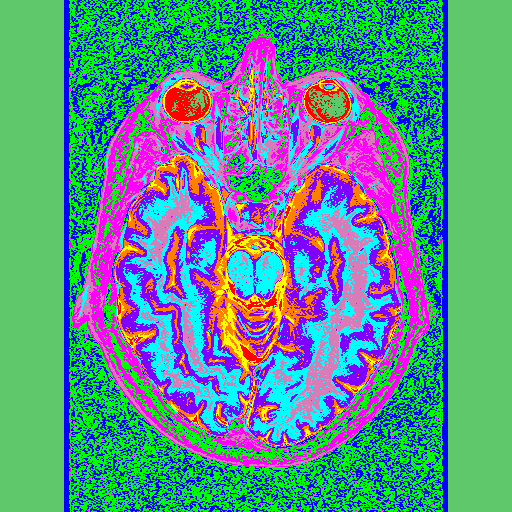

# MedicalImageAnalysis.Web

A modular ASP.NET Core web application for uploading, visualizing, and analyzing medical images (DICOM, NIfTI, PNG, JPG). Designed for extensibility and cross-language reproducibility, this project is designated for showcasing basic medical image processing pipelines. 
Completed roadmap stages with example pictures are presented below.

## Features

- **Image Upload & Display**  
  Upload DICOM, PNG, JPG, and (planned) NIfTI files via a simple web UI.  
  DICOM metadata (patient, modality) is extracted and displayed.  
  Uploaded images are rendered and previewed in-browser.

- **Modular Architecture**  
  - **Pages/**: Razor Pages UI  
  - **Services/**: Core logic (preprocessing, clustering, segmentation)  
  - **Models/**: Data models (e.g., image data, pipeline configs)  
  - **Data/**: File I/O and dataset loading  
  - **Utils/**: Shared helpers (image conversion, metrics, timing)

- **Planned Core Functionalities**  
  - **Data Loading**: Unified handling for DICOM, NIfTI, PNG, JPG  
  - **Preprocessing**: PCA using Math.NET Numerics  
  - **Clustering**: K-means (Math.NET or ML.NET)  
  - **Segmentation**: Otsu, adaptive/manual thresholding, region growing, watershed  
  - **Visualization**: Interactive overlays (Canvas/SVG), side-by-side comparison, performance metrics

- **Pipeline Execution**  
  - Model analysis as configurable pipelines (Load → PCA → KMeans → Segmentation)  
  - Save/load pipeline configs (JSON)  
  - Log execution time per step

- **Cross-Language Consistency**  
  - Deterministic seeds for reproducibility  
  - Well-defined input/output contracts  
  - Designed for future porting to Python or other languages

## Tech Stack

- **ASP.NET Core Razor Pages** (.NET 8)
- **fo-dicom** (DICOM support)
- **SixLabors.ImageSharp** (image processing)
- **MathNet.Numerics** (math, PCA, clustering)
- **Bootstrap, jQuery** (UI)

## Getting Started

1. **Clone the repository**
2. **Install dependencies**  
   ```
   dotnet restore
   ```
3. **Build and run**  
   ```
   dotnet run
   ```
4. **Open in browser**  
   Navigate to `https://localhost:<port>` (port indicated in console)

## Project Structure

```
MedicalImageAnalysis.Web/
├── Pages/                 # Razor Pages (UI)
├── Services/              # Core logic (planned)
├── Models/                # Data models (planned)
├── Data/                  # File I/O, dataset loading (planned)
├── Utils/                 # Shared helpers (planned)
├── wwwroot/               # Static assets (CSS, JS)
├── Program.cs             # App entrypoint
├── MedicalImageAnalysis.Web.csproj
└── ...
```

## Roadmap

- ✅ DICOM/PNG/JPG upload & preview, DONE.  
  
  
- [-] NIfTI support, skipped.
- ✅ Segmentation algorithms. Otsu. DONE  
  
  
- ✅ K-means clustering. DONE  
  
    
- ✅ PCA preprocessing. DONE
  implemented basic PCA preprocessing functionality.

- [ ] Segmentation algorithms ( region growing)
- [ ] Segmentation algorithms ( watershed )
- [ ] Interactive visualization ( Canvas/SVG overlays )
- [ ] Pipeline configuration UI
- [-] Save/load pipeline configs into JSON. Optional

## License

This project uses open-source libraries under MIT and similar licenses. See `/wwwroot/lib/*/LICENSE*` for details.